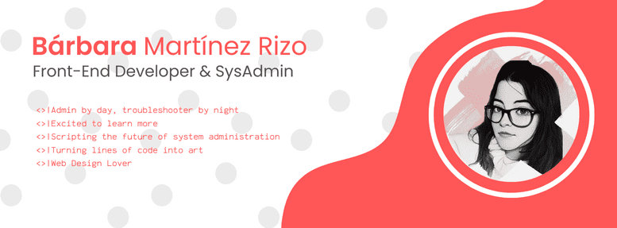
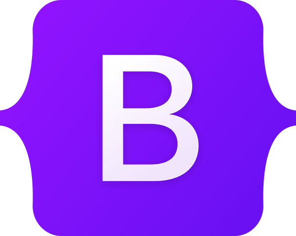

# ¡Hola! Mi nombre es

**Aprendiz eterna en el mundo de la administración de sistemas y el desarrollo de aplicaciones web.** Navegando a través de desafíos tecnológicos con **entusiasmo inquebrantable**. Siempre en busca de nuevas formas de **expandir mis habilidades y conocimientos** mientras construyo y optimizo sistemas y aplicaciones que impulsen el futuro digital.

## Sobre mi 😀

- Trabajo en ODEC como Administradora de Sistemas.
- Actualmente estoy en continua formación enfocada al desarrollo web de manera autodidacta.
- Proximamente lanzare mi portafolio personal, donde poder ver mis proyectos y experiencia con más claridad.

 

## APPs y Herramientas que uso:

### Desarrollo 💻

 

 

### Sistemas ⚙

## Contacto ✉

