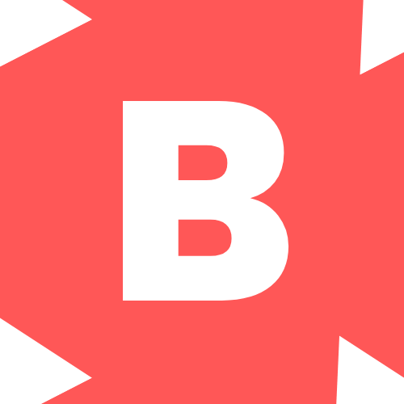

<head>

</head>
# ¡Hola! Mi nombre es

**Aprendiz eterna en el mundo de la administración de sistemas y el desarrollo de aplicaciones web.** Navegando a través de desafíos tecnológicos con **entusiasmo inquebrantable**. Siempre en busca de nuevas formas de **expandir mis habilidades y conocimientos** mientras construyo y optimizo sistemas y aplicaciones que impulsen el futuro digital.

## APPs y Herramientas que uso:

## Desarrollo 💻

## Sistemas ⚙

## Contacto ✉

